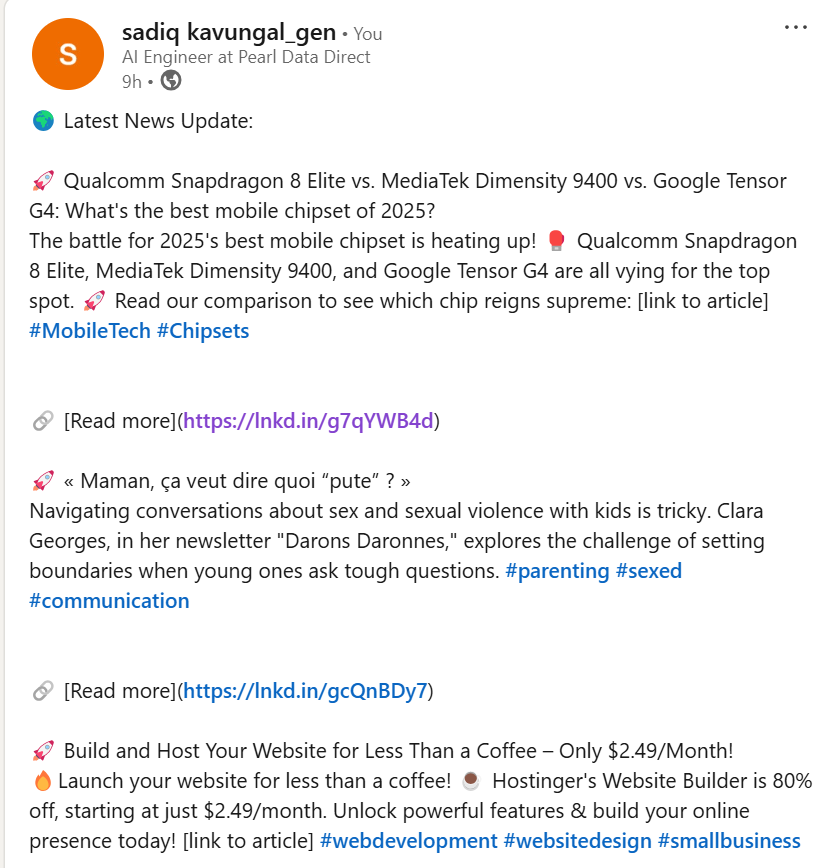
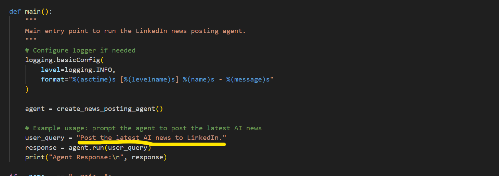

Here's your **structured README.md** with improved formatting, clarity, and readability:

# AgenticLinkedinPoster

**AgenticLinkedinPoster** is an AI-powered agent that fetches **news** related to prompted topics and publishes them automatically to **LinkedIn**. This repository contains code, documentation, and tests for automating LinkedIn posts using AI-generated or user-provided prompts.

## 📸 Output Screenshot

Below is an example output while the bot is running:


Screenshot which agent Posted in Linkedin



## 🏗 Repository Structure

```
📂 AgenticLinkedinPoster/
│── main.py               # Entry point for running the bot
│── news_fetcher.py       # Handles news fetching from NewsAPI
│── post_generator.py     # Uses Groq AI to generate LinkedIn posts
│── linkedin_poster.py    # Handles LinkedIn API interactions
│── config.py             # Stores configuration settings
│── requirements.txt      # Lists required Python packages
│── .env                  # Stores API credentials (not included in the repo)
│── image.png             # Screenshot of the running script
```

## Prompt
```
📂 AgenticLinkedinPoster/
│── main.py 
```



## 🔧 Prerequisites

To use this project, you need API credentials for the following services:

1. **NewsAPI** (Fetches news articles)
   - Sign up at [NewsAPI.org](https://newsapi.org/) to get an API key.

2. **Groq AI** (Generates LinkedIn post summaries)
   - Register at [Groq](https://groq.com/) to obtain an API key.

3. **LinkedIn API** (Publishes posts to LinkedIn)
   - Set up OAuth authentication at [LinkedIn Developer](https://developer.linkedin.com/product-catalog).

4. **Langchain API** (For observability & agent operations)
   - Register at [Langchain](https://www.langchain.com/) to obtain API credentials.


## 🚀 Installation

### 1️⃣ Configure API Keys
Modify the `config.py` file to set up the necessary API credentials:

```python
GROQ_API_KEY = "your_groq_api_key"
NEWS_API_KEY = "your_newsapi_key"
LINKEDIN_ACCESS_TOKEN = "your_linkedin_access_token"
LINKEDIN_USER_ID = "your_linkedin_user_id"
```

For **observability**, you can use **Langchain**:

```python
LANGCHAIN_API_KEY = "your_langchain_api_key"
LANGCHAIN_PROJECT = "linkedin_Post_Master"
LANGSMITH_TRACING = True
```


### 2️⃣ Clone the Repository
Run the following commands in your terminal:

```bash
# Clone the repository
git clone https://github.com/sadiqkavungal/AgenticLinkedinPoster.git
cd AgenticLinkedinPoster

# Create a virtual environment
python -m venv venv
source venv/bin/activate  # On Windows use `venv\Scripts\activate`

# Install dependencies
pip install -r requirements.txt

# Run the bot
python main.py
```


## 🤖 How the AI Agent Posts News to LinkedIn

1️⃣ Fetches the latest news from **NewsAPI**.  
2️⃣ Uses **Groq AI** to generate engaging LinkedIn post content.  
3️⃣ Automatically posts the content to **LinkedIn** using the **LinkedIn API**.  
4️⃣ Logs and traces execution using **Langchain Observability**.


## 📬 Contact & Contributions

✅ **Contributions are welcome!**  
Feel free to open issues, fork the repo, and submit pull requests.

📧 Contact: [sadiq kavungal]  
🔗 GitHub: [https://github.com/sadiqkavungal] 

