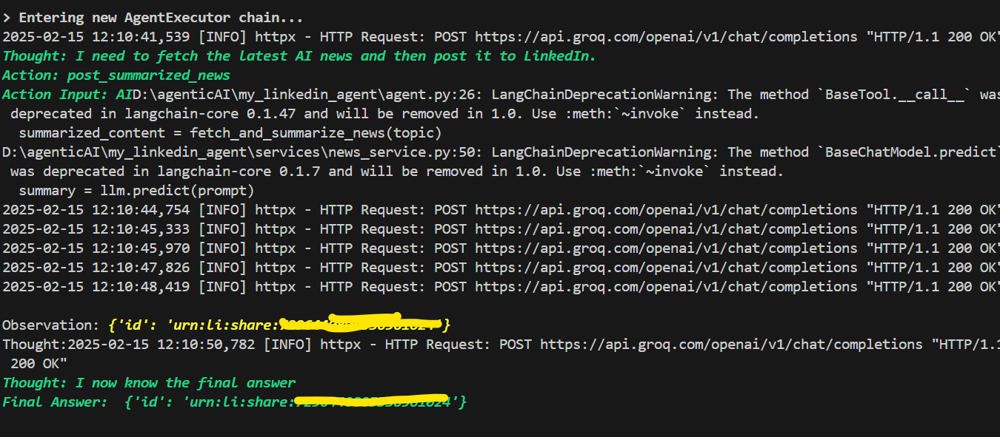

# AgenticLinkedinPoster
An AI agent that publishes prompted topics related News to LinkedIn. This repository contains code, documentation, and tests for automating LinkedIn posts based on AI-generated or user-provided prompts.


### Repository Structure
```
    main.py: Entry point for running the bot.
    news_fetcher.py: Handles news fetching from NewsAPI.
    post_generator.py: Uses Groq AI to generate LinkedIn posts.
    linkedin_poster.py: Handles LinkedIn API interactions.
    config.py: Stores configuration settings.
    requirements.txt: Lists required Python packages.
    .env: Stores API credentials (not included in the repo).
```


## Prerequisites
    Create the api credentials for the follwing...
1. NewsAPI
    Fetches the latest news articles. You must sign up at NewsAPI.org to get your API key.
    ```
        https://newsapi.org/
    ```
2. Groq AI
    Used to generate summaries or engaging content based on the news. You need to register and obtain an API key from Groq.
    ```
        https://groq.com/
    ```
3. LinkedIn API
    Used to publish posts on LinkedIn. You need to set up OAuth authentication to get access tokens.
    ```
        https://developer.linkedin.com/product-catalog
    ```
4. Langchain API 
    ```
        https://www.langchain.com/
    ```


## Installation

1. Configuration
    Modify the ``config.py`` file to adjust settings like:
    ```
        News categories and sources for NewsAPI.
        The style of LinkedIn post generation using Groq AI.
        GROQ_API_KEY=""
        NEWS_API_KEY=""
        LINKEDIN_ACCESS_TOKEN=""
        LINKEDIN_USER_ID=""
    ```
    For observablity you may use langchain 
    ```
        LANGCHAIN_API_KEY=""
        LANGCHAIN_PROJECT="linkedin_Post_Master"
        LANGSMITH_TRACING=true
    ```


2. Clone the repository:
   ```bash
   git clone https://github.com/sadiqkavungal/AgenticLinkedinPoster.git
   cd AgenticLinkedinPoster

    python -m venv venv
    source venv/bin/activate  # On Windows use `venv\\Scripts\\activate`


   pip install -r requirements.txt

   python main.py 

## How AI Agent Post news into linkedin

### output



